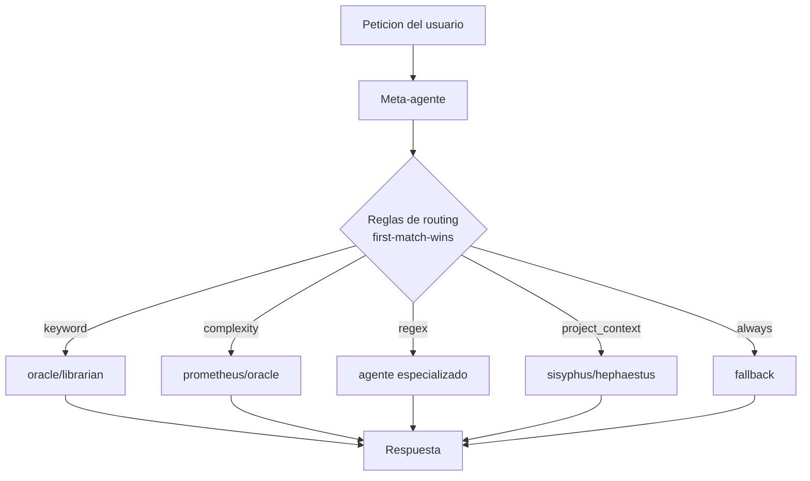
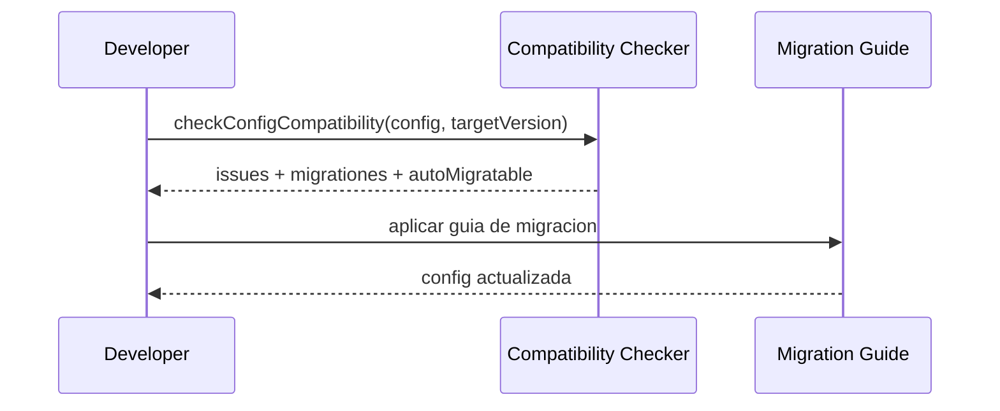
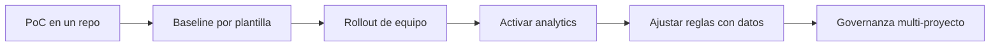

# Playbook de Implementacion de Olimpus

Guia practica para implementar, escalar y operar Olimpus en proyectos reales.

Este documento prioriza ejecucion: que configurar, cuando usar cada feature y
como evitar errores tipicos.

---

## 1) Que puedes construir con Olimpus

Con Olimpus puedes montar 6 capacidades clave:

1. Routing por meta-agentes sobre agentes nativos
2. Delegacion por reglas (5 tipos de matcher)
3. Plantillas reutilizables para arrancar rapido
4. Analytics local y exportacion Prometheus
5. Config IO y registro multi-proyecto
6. Controles de estabilidad y compatibilidad para upgrades seguros

---

## 2) Arquitectura en 30 segundos



Principio clave: reglas explicitas y ordenadas por valor de negocio.

---

## 3) Como se apoya en oh-my-opencode

Olimpus no sustituye a oh-my-opencode: lo extiende.

- Base de oh-my-opencode: agentes, hooks, skills, MCPs y compatibilidad de
  plugins.
- Capa Olimpus: meta-agentes, reglas de routing, plantillas y gobernanza por
  proyecto.
- Resultado: mantienes workflows conocidos y ganas delegacion automatica y
  trazable.

```mermaid
flowchart LR
    OM[oh-my-opencode]\nBase runtime --> OL[Olimpus]\nMeta-routing + templates
    OL --> PR[Comportamiento por proyecto]
```

---

## 4) Implementacion por escenarios

## Escenario A: Arranque de equipo (safe defaults)

```jsonc
{
  "meta_agents": {
    "delivery": {
      "base_model": "claude-3-5-sonnet-20241022",
      "delegates_to": ["sisyphus", "oracle", "librarian"],
      "routing_rules": [
        {
          "matcher": {
            "type": "keyword",
            "keywords": ["docs", "api"],
            "mode": "any"
          },
          "target_agent": "librarian"
        },
        {
          "matcher": { "type": "complexity", "threshold": "high" },
          "target_agent": "oracle"
        },
        { "matcher": { "type": "always" }, "target_agent": "sisyphus" }
      ]
    }
  }
}
```

Buenas practicas:

- 1 meta-agente al principio.
- Maximo 3 reglas iniciales.
- Fallback `always` obligatorio.
- Validar antes de desplegar: `bun run olimpus validate olimpus.jsonc`.

## Escenario B: Monorepo

Usa `project_context` para delegar por estructura real de repo:

```jsonc
{
  "matcher": {
    "type": "project_context",
    "has_files": ["package.json", "apps/web/"],
    "has_deps": ["vite", "react"]
  },
  "target_agent": "sisyphus"
}
```

## Escenario C: Registro multi-proyecto + Config IO

```ts
import { loadProjectRegistryConfig } from "../src/config/loader.js";
import {
  exportProjectConfig,
  importProjectConfig,
} from "../src/config/project-io.js";

const registry = await loadProjectRegistryConfig();
const { config } = await importProjectConfig(process.cwd(), {
  location: "project",
  validate: true,
});

await exportProjectConfig(config, process.cwd(), {
  location: "project",
  validate: true,
  createDir: true,
  indent: 2,
});
```

Ruta por defecto del registro:

- `~/.config/opencode/registry.jsonc`

## Escenario D: Plantillas

```bash
bun run olimpus templates list
bun run olimpus templates show workflow/tdd
bun run olimpus templates apply workflow/tdd --output olimpus.jsonc
```

Flujo recomendado:

1. Elegir baseline.
2. Aplicar a `olimpus.jsonc`.
3. Validar.
4. Versionar en git como estandar de equipo.

## Escenario E: Analytics + Prometheus

```jsonc
{
  "settings": {
    "analytics": {
      "enabled": true,
      "storage": {
        "type": "file",
        "path": ".olimpus/analytics.json",
        "retention_days": 90
      },
      "aggregation": {
        "enabled": true,
        "window_minutes": 60,
        "include_percentiles": true
      }
    }
  }
}
```

## Escenario F: Upgrades seguros



---

## 5) Heuristicas de diseno de reglas

- `project_context` para decisiones por estructura de repo.
- `keyword` para buckets de intencion.
- `regex` solo para patrones estrictos.
- `complexity` para escalar a analisis profundo.
- `always` siempre al final.

Antipatrones comunes:

- Reglas regex solapadas sin orden claro.
- Sin fallback final.
- Meta-agentes con demasiadas reglas sin agrupar por objetivo.

---

## 6) Checklist de verificacion

Antes de desplegar cambios de config:

1. `bun run olimpus validate olimpus.jsonc`
2. `bun run typecheck`
3. `bun test`
4. Probar rutas criticas con prompts reales
5. Verificar ausencia de ciclos y referencias invalidas

---

## 7) Roadmap de adopcion recomendado



---

## 8) Documentos relacionados

- API: `docs/API.md`
- Estabilidad: `docs/STABILITY.md`
- Plantilla de migracion: `docs/MIGRATION_TEMPLATE.md`
- Catalogo de templates: `templates/README.md`
- Tutoriales: `docs/tutorials/`
