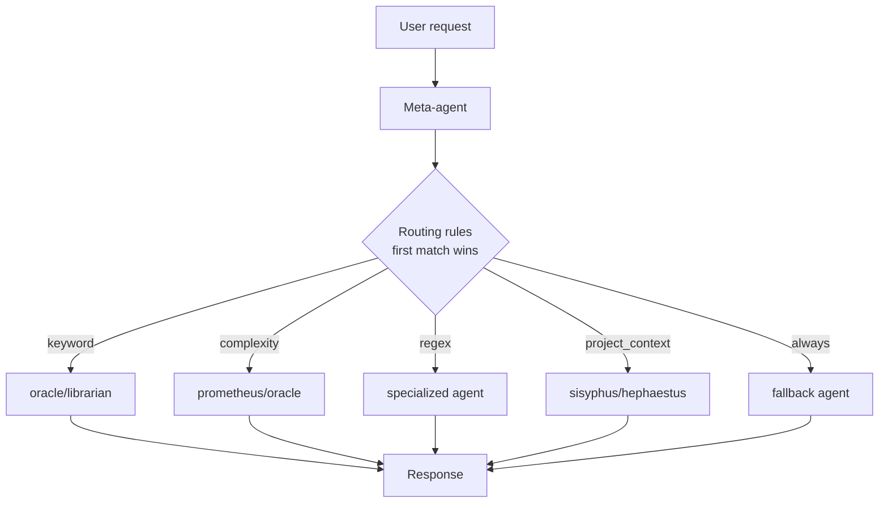
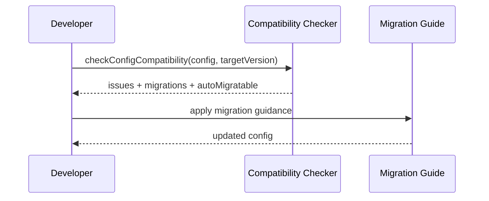
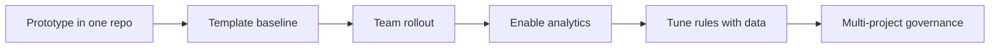

# Olimpus Implementation Playbook

Practical guide to implement, scale, and operate Olimpus in real projects.

This playbook is opinionated and action-oriented: what to configure, when to use
each feature, and how to avoid common anti-patterns.

---

## 1) What You Can Build With Olimpus

At a high level, Olimpus gives you six building blocks:

1. Meta-agent routing over builtin agents
2. Rule-based delegation using 5 matcher types
3. Reusable template packs for quick setup
4. Local analytics and Prometheus export
5. Multi-project config IO and registry support
6. Stability and compatibility controls for safe evolution

---

## 2) Architecture at a Glance



Core principle: keep rules explicit and deterministic. If two rules could match,
put the highest business value first.

---

## 3) How Olimpus Extends oh-my-opencode

Olimpus is designed as a compatibility-first extension layer on top of
oh-my-opencode.

- oh-my-opencode already provides agents, hooks, skills, MCPs, and plugin
  compatibility (`node_modules/oh-my-opencode/README.md`).
- Olimpus adds domain routing logic and project-specific orchestration using
  `meta_agents` and routing rules.
- You keep using standard OpenCode/OmO workflows, but with deterministic
  policy-based delegation.

```mermaid
flowchart LR
    OM[oh-my-opencode base]\nAgents + Hooks + Skills + MCPs --> OL[Olimpus layer]\nMeta-agents + routing + templates
    OL --> PR[Project-specific behavior]
```

Design consequence: prefer extending via config and templates before touching
runtime code.

---

## 4) Implementation by Scenario

## Scenario A: Team Startup (Fast, Safe Defaults)

Use this when adopting Olimpus in a new codebase.

```jsonc
{
  "meta_agents": {
    "delivery": {
      "base_model": "claude-3-5-sonnet-20241022",
      "delegates_to": ["sisyphus", "oracle", "librarian"],
      "routing_rules": [
        {
          "matcher": {
            "type": "keyword",
            "keywords": ["docs", "api"],
            "mode": "any"
          },
          "target_agent": "librarian"
        },
        {
          "matcher": { "type": "complexity", "threshold": "high" },
          "target_agent": "oracle"
        },
        {
          "matcher": { "type": "always" },
          "target_agent": "sisyphus"
        }
      ]
    }
  }
}
```

Implementation notes:

- Start with one meta-agent and 3 rules max.
- Add `always` as explicit fallback.
- Validate before rollout: `bun run olimpus validate olimpus.jsonc`.

## Scenario B: Monorepo Routing

Use `project_context` for deterministic package-aware delegation.

```jsonc
{
  "matcher": {
    "type": "project_context",
    "has_files": ["package.json", "apps/web/"],
    "has_deps": ["vite", "react"]
  },
  "target_agent": "sisyphus"
}
```

Rule strategy:

- First rules: hard project detection (`project_context`).
- Middle rules: request intent (`keyword`/`regex`).
- Last rule: fallback (`always`).

## Scenario C: Config Import/Export and Registry

Use this for centralized governance across multiple repositories.

```ts
import { loadProjectRegistryConfig } from "../src/config/loader.js";
import {
  exportProjectConfig,
  importProjectConfig,
} from "../src/config/project-io.js";

const registry = await loadProjectRegistryConfig();

const { config } = await importProjectConfig(process.cwd(), {
  location: "project",
  validate: true,
});

await exportProjectConfig(config, process.cwd(), {
  location: "project",
  validate: true,
  createDir: true,
  indent: 2,
});
```

Registry file location:

- default: `~/.config/opencode/registry.jsonc`

## Scenario D: Templates as Bootstrap Layer

Use templates to create repeatable team standards.

```bash
bun run olimpus templates list
bun run olimpus templates show workflow/tdd
bun run olimpus templates apply workflow/tdd --output olimpus.jsonc
```

Template workflow:

1. Select baseline template.
2. Apply with output to project config.
3. Validate config.
4. Commit as team standard.

## Scenario E: Analytics + Prometheus

Use analytics to tune routing based on real usage.

```jsonc
{
  "settings": {
    "analytics": {
      "enabled": true,
      "storage": {
        "type": "file",
        "path": ".olimpus/analytics.json",
        "retention_days": 90
      },
      "aggregation": {
        "enabled": true,
        "window_minutes": 60,
        "include_percentiles": true
      }
    }
  }
}
```

Operational loop:

- Observe top matchers and unmatched requests.
- Add or reorder rules.
- Re-check with `analytics show` and exports.

## Scenario F: Stability and Compatibility in Upgrades

Use compatibility utilities before changing config contracts.



Upgrade policy:

- Add deprecations first.
- Keep warnings for at least 2 minor versions.
- Remove only with migration guidance documented.

---

## 5) Rule Design Heuristics

Use these to keep routing predictable:

- Prefer `project_context` when repository shape matters.
- Use `keyword` for broad intent buckets.
- Use `regex` only for explicit syntax-driven patterns.
- Use `complexity` for escalation to architecture-level analysis.
- Keep `always` as last rule only.

Anti-patterns:

- Overlapping regex rules without ordering rationale.
- Missing fallback rule.
- More than 10 rules in one meta-agent without grouping strategy.

---

## 6) Verification Checklist

Before shipping a config change:

1. `bun run olimpus validate olimpus.jsonc`
2. `bun run typecheck`
3. `bun test`
4. Run one real request per critical routing path
5. Confirm no circular delegation and no invalid references

---

## 7) Recommended Rollout Strategy



Start small, instrument behavior, then scale via templates and registry-based
governance.

---

## 8) Where to Go Next

- API surface: `docs/API.md`
- Stability policy: `docs/STABILITY.md`
- Migration format: `docs/MIGRATION_TEMPLATE.md`
- Templates catalog: `templates/README.md`
- Hands-on examples: `docs/tutorials/`
