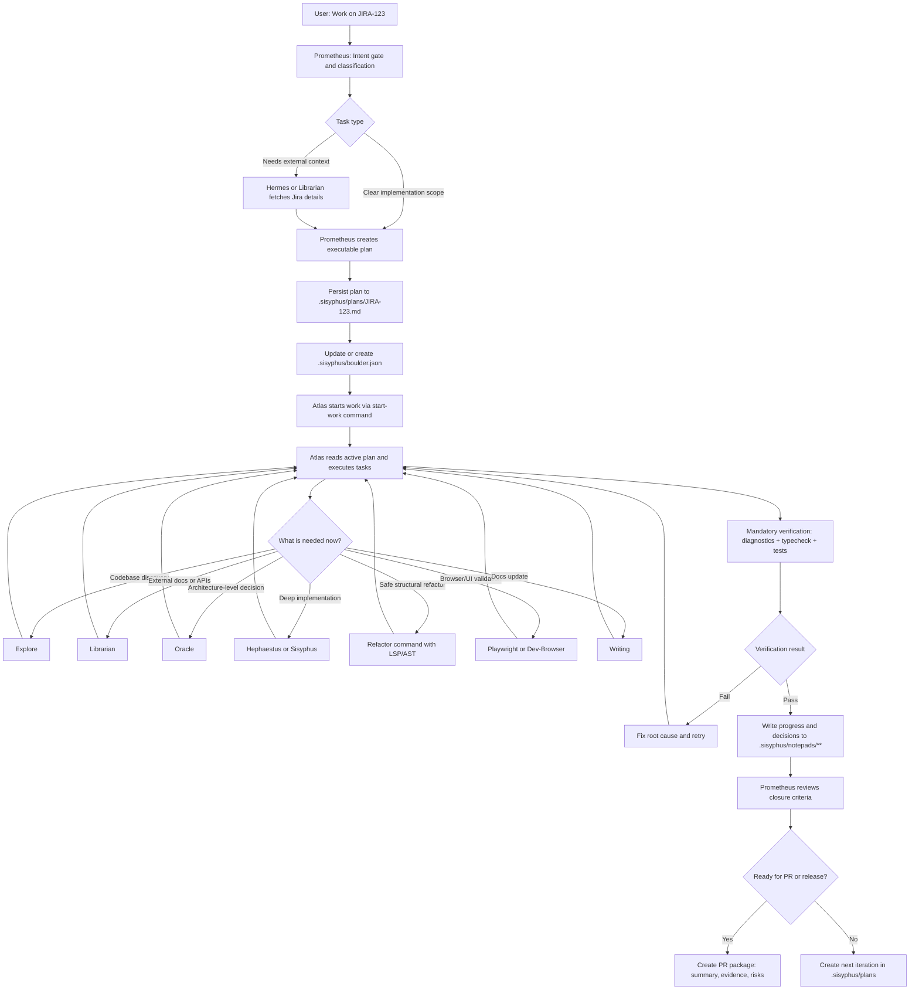

# Jira Orchestration Flow (Prometheus -> Atlas)

This flow reflects the actual persisted paths used in this environment:

- Plans: `.sisyphus/plans/*.md`
- Active session state: `.sisyphus/boulder.json`
- Working notes: `.sisyphus/notepads/**`

